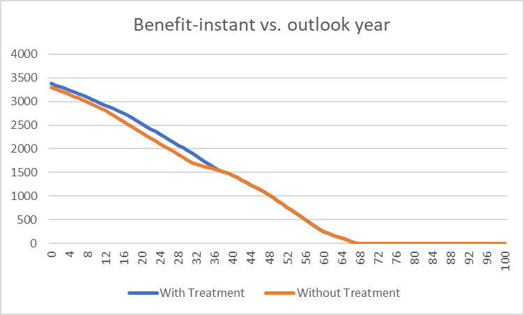

# iAM Benefit Calculation

## Essential Symbols & Terms

- $A$ : benefit attribute
- $B$ : benefit value
- $C$ : cumulative benefit value
- $L$ : benefit limit value
- $N$ : outlook period
- $W$ : benefit weight attribute
- $b$ : benefit-instant value
- $b'$ : limit-relativized unweighted (LRU) benefit-instant value
- $b^A$ : benefit attribute value
- $w$ : benefit weight attribute value
- $t$ : year of outlook period, $t \in \{0, 1, \dots, N\}$

## Overview of Calculation

The benefit value $B_T$ of treatment $T$ is the cumulative benefit value $C_T$ of $T$ minus the cumulative benefit value $C_P$ of the passive treatment $P$:

$$
B_T = C_T - C_P
$$

Each $C$ is calculated independently over the outlook period $N$, a fixed whole number of years starting from the current year.
To understand the calculation, it's helpful to visualize with a line plot of yearly benefit-instant values over time.

    

Cumulative benefit is the area under each of these curves.
Benefit is the area between the two curves.
(Negative benefit is possible.)
Each point on the plot is a $(t, b)$ pair.
Given the series $b = (b_0, b_1, \dots, b_N)$ of benefit-instant values over outlook period $N$, the cumulative benefit is

$$
C = \sum_{t=1}^{N}\left(b_{t-1} + \frac{b_t - b_{t-1}}{2}\right)
$$

For a given outlook year $t$ and benefit weight attribute value $w_t$, the benefit-instant value is

$$
b_t = \max(0, b_t') \times w_t
$$

where, given the benefit limit value $L$ and benefit attribute value $b_t^A$, the LRU benefit-instant value is

$$
b_t' =
\begin{cases}
b_t^A - L &\text{if $A$ decreases with deterioration} \\
L - b_t^A &\text{if $A$ increases with deterioration.}
\end{cases}
$$

Given the benefit attribute value series $b^A = (b_0^A, b_1^A, \dots, b_N^A)$, these equations allow calculation of $C$ and then $B_T$.
